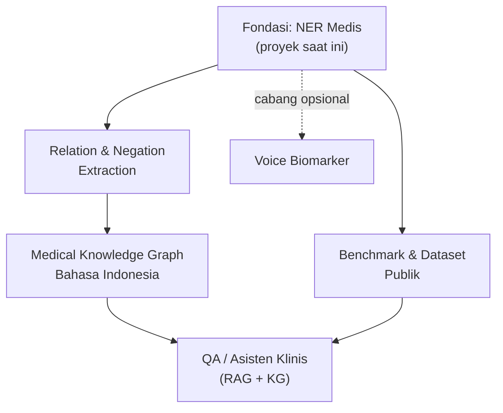

# 5. Visi Jangka Panjang — Evolusi Proyek NER

<aside>
🌱

Dokumen ini memetakan **evolusi proyek NER Medis Bahasa Indonesia** dari sebuah proyek tunggal menjadi **proyek payung jangka panjang (1–3 tahun)**. Tujuannya: tiap fase berdiri sendiri & punya hasil nyata (deliverable untuk CV), tapi semuanya saling menumpuk membentuk *moat* — korpus, model, dan reputasi riset di domain NLP medis Bahasa Indonesia yang sulit ditiru.

</aside>

## 🎯 Visi besar

> Menjadi salah satu fondasi **NLP medis Bahasa Indonesia** yang paling lengkap & terbuka — mulai dari ekstraksi entitas, relasi antar-entitas, knowledge graph, hingga asisten tanya-jawab klinis — yang bisa disitasi, dipakai ulang, dan dikembangkan komunitas.
> 

## 🧭 Prinsip proyek jangka panjang

- **Berfase & modular** — tiap fase punya *definition of done* yang jelas dan bisa dihentikan tanpa membuang kerja sebelumnya.
- **Compounding** — data, model, dan dokumentasi menumpuk; makin lama makin bernilai.
- **Punya moat** — data medis Bahasa Indonesia langka, jadi setiap korpus & model yang kamu bangun jadi aset langka.
- **Riset + produk sekaligus** — tiap fase bisa jadi bahan paper, isi portofolio, atau modul produk.

## 🗺️ Peta evolusi (gambaran)

## 📅 Roadmap multi-fase

### 🟢 Tahap 1 — Fondasi NER (0–3 bulan)

*Status: proyek yang sedang berjalan (lihat [3. Roadmap — Instruksi untuk AI (Kerjakan Sampai Selesai)](https://app.notion.com/p/3-Roadmap-Instruksi-untuk-AI-Kerjakan-Sampai-Selesai-35d09a723f6f409c8d49573a3b848543?pvs=21)).*

- Selesaikan pipeline NER end-to-end: data → anotasi BIO → fine-tuning IndoBERT vs XLM-R → evaluasi → demo → dokumentasi.
- **Deliverable:** model NER terlatih, dataset BIO, laporan metrik, demo, README.
- **Definition of Done:** seluruh checklist Fase 0–6 di dokumen roadmap terpenuhi.

### 🔵 Tahap 2 — Relation & Negation Extraction (3–6 bulan)

- Tambah **relation extraction**: hubungkan entitas (mis. `GEJALA` → `DIAGNOSIS`, `OBAT` → `DOSIS`).
- Tambah **negation & uncertainty detection** (mis. "tidak demam", "kemungkinan infeksi").
- Perluas dataset & skema anotasi untuk mendukung relasi.
- **Deliverable:** model relasi + dataset beranotasi relasi, laporan evaluasi.
- **Definition of Done:** sistem bisa mengeluarkan triple (entitas–relasi–entitas) terukur dengan F1 terdokumentasi.

### 🟣 Tahap 3 — Medical Knowledge Graph (6–12 bulan)

- Bangun **knowledge graph** dari hasil ekstraksi entitas + relasi.
- Normalisasi entitas ke konsep standar (mis. pemetaan ke kode/terminologi medis bila memungkinkan).
- Simpan ke graph DB (mis. Neo4j) + visualisasi.
- **Deliverable:** KG yang bisa di-query + antarmuka eksplorasi.
- **Definition of Done:** KG bisa menjawab query terstruktur (mis. "obat apa yang terkait gejala X").

### 🟠 Tahap 4 — QA / Asisten Klinis (12–24 bulan)

- Bangun sistem tanya-jawab Bahasa Indonesia: **RAG** di atas korpus + **knowledge graph**.
- Integrasikan model NER/relasi sebagai pemahaman terstruktur.
- **Deliverable:** web app asisten klinis (tanya-jawab dari catatan/guideline).
- **Definition of Done:** sistem menjawab pertanyaan klinis dengan rujukan sumber & evaluasi kualitas jawaban.

### 🔴 Tahap 5 — Benchmark & Dataset Publik (paralel, berkelanjutan)

- Rilis dataset + **leaderboard publik** untuk task NLP medis Indonesia (NER, relasi, QA).
- Dorong kontribusi komunitas; jaga kualitas & versioning.
- **Deliverable:** dataset terbuka + halaman benchmark + (opsional) paper.
- **Definition of Done:** dataset dipublikasikan, dapat diunduh, dan mulai disitasi/dipakai orang lain.

## 🌿 Cabang opsional

<aside>
🎙️

**Voice Biomarker** — track medtech anti-mainstream: analisis sinyal suara untuk skrining kesehatan. Bisa dimulai kapan saja sebagai proyek paralel, lalu hasilnya digabung ke asisten klinis di Tahap 4. Lihat [Proyek Medical Technology untuk CV (Anti-Mainstream)](https://app.notion.com/p/Proyek-Medical-Technology-untuk-CV-Anti-Mainstream-9731685da2744af3bc6460a4acca4115?pvs=21).

</aside>

## ✅ Checklist milestone besar

- [ ]  Tahap 1 — Fondasi NER selesai (model + dataset + demo + dokumentasi)
- [ ]  Tahap 2 — Relation & negation extraction berjalan & terukur
- [ ]  Tahap 3 — Knowledge graph dapat di-query
- [ ]  Tahap 4 — Asisten klinis QA berjalan dengan rujukan sumber
- [ ]  Tahap 5 — Dataset/benchmark publik dirilis
- [ ]  (Opsional) Voice biomarker terintegrasi

## 📊 Ringkasan tahap

| Tahap | Perkiraan waktu | Hasil utama | Nilai untuk CV |
| --- | --- | --- | --- |
| 1 — Fondasi NER | 0–3 bln | Model NER + demo | Bukti skill ML/NLP end-to-end |
| 2 — Relasi & negasi | 3–6 bln | Ekstraksi triple | NLP tingkat lanjut |
| 3 — Knowledge graph | 6–12 bln | KG ter-query | Data engineering + KG |
| 4 — Asisten QA | 12–24 bln | Web app RAG+KG | Full-stack AI product |
| 5 — Benchmark publik | Berkelanjutan | Dataset + leaderboard | Reputasi & sitasi riset |

## 🔗 Terhubung dengan

- Folder proyek: [NLP Medis Bahasa Indonesia (NER) — Dokumen Proyek](https://app.notion.com/p/NLP-Medis-Bahasa-Indonesia-NER-Dokumen-Proyek-02f2b9a09c134677a0fced571f19f748?pvs=21)
- Roadmap teknis fase 0–6: [3. Roadmap — Instruksi untuk AI (Kerjakan Sampai Selesai)](https://app.notion.com/p/3-Roadmap-Instruksi-untuk-AI-Kerjakan-Sampai-Selesai-35d09a723f6f409c8d49573a3b848543?pvs=21)
- Ide proyek medtech: [Proyek Medical Technology untuk CV (Anti-Mainstream)](https://app.notion.com/p/Proyek-Medical-Technology-untuk-CV-Anti-Mainstream-9731685da2744af3bc6460a4acca4115?pvs=21)