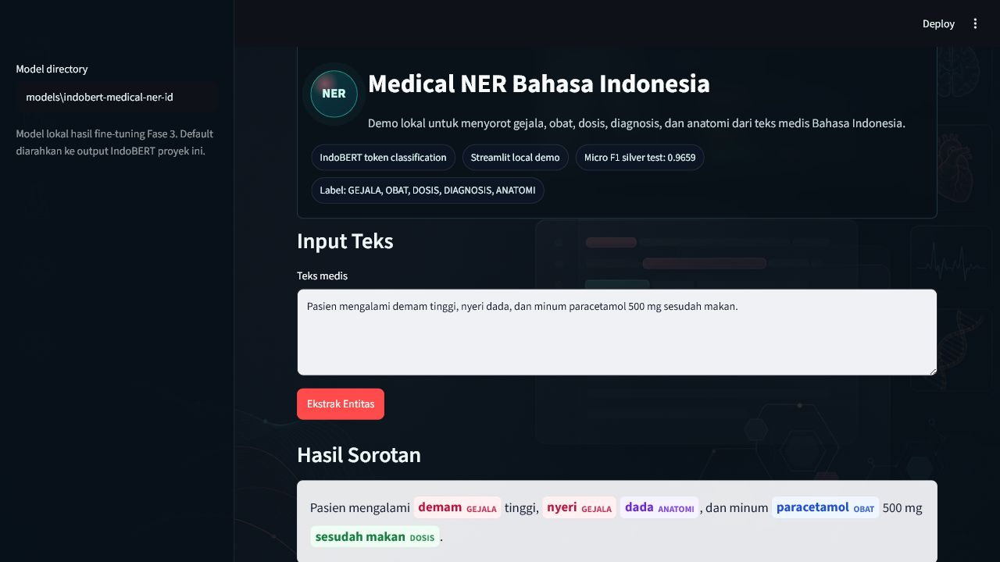
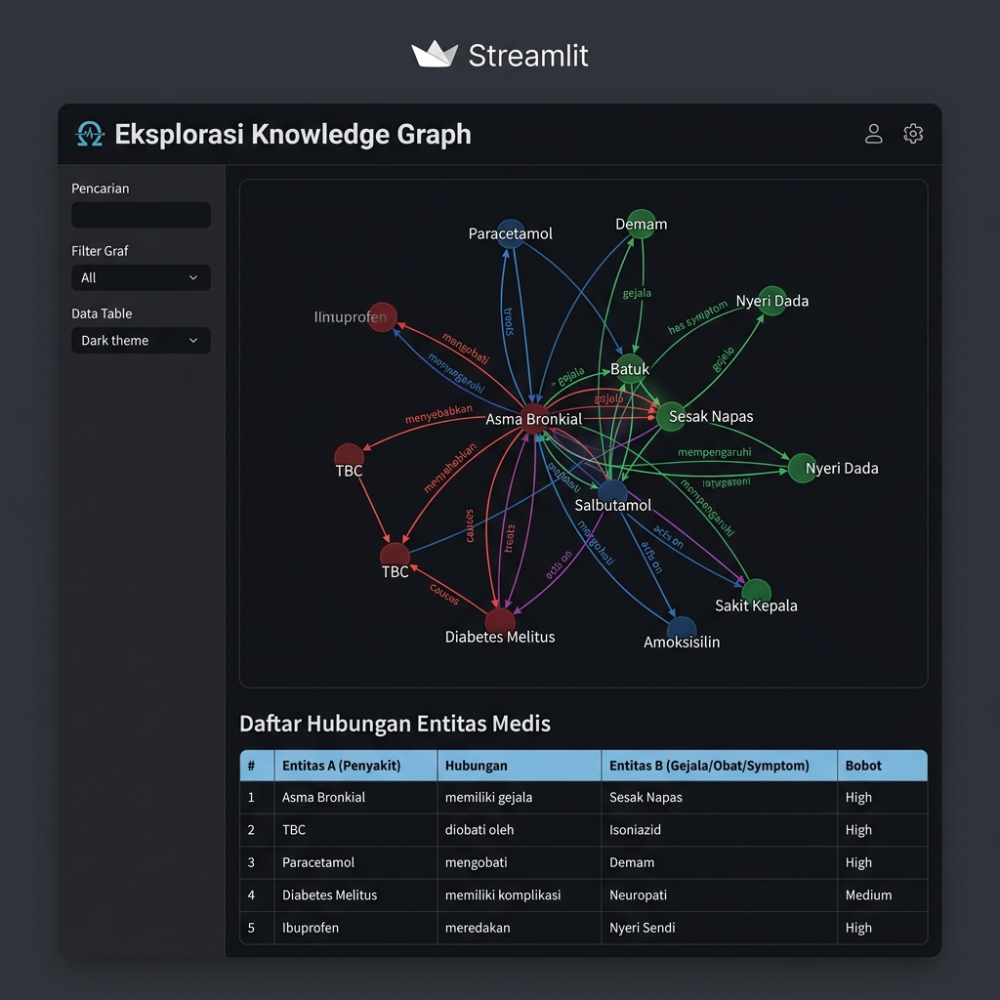
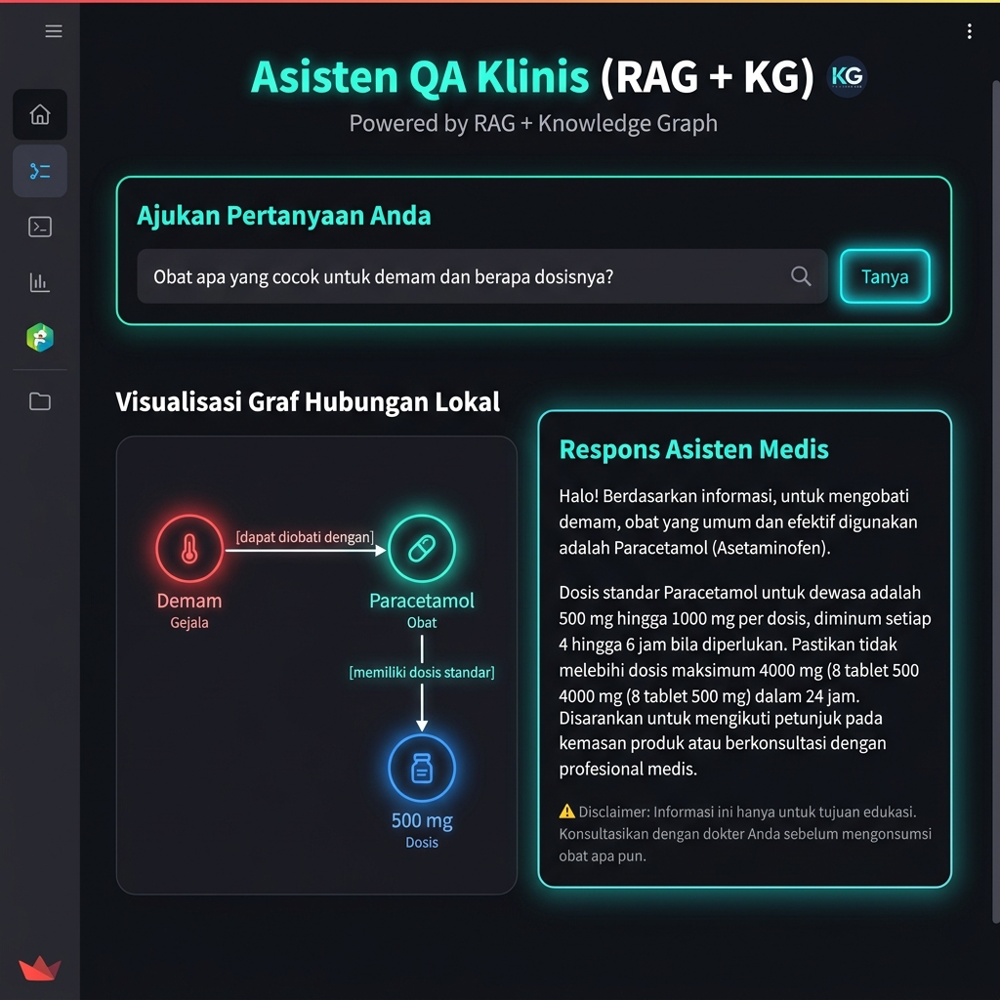

# Ekstraksi Informasi Otomatis dari Teks Medis Bahasa Indonesia


Proyek ini membangun sistem Named Entity Recognition (NER) untuk mengekstraksi
entitas medis dari teks Bahasa Indonesia. Entitas yang dikenali saat ini adalah
`GEJALA`, `OBAT`, `DOSIS`, `DIAGNOSIS`, dan `ANATOMI`.

Output utama proyek:

- pipeline data dari korpus mentah ke format BIO/CoNLL;
- dataset silver berbasis rules dan lexicon dengan **augmentasi substitusi entitas**;
- fine-tuned IndoBERT sebagai model utama;
- fine-tuned XLM-RoBERTa sebagai model pembanding multibahasa;
- model assertion status (negasi/ragu) dan relation extraction;
- **Medical Knowledge Graph** dengan standardisasi kode ICD-10 & ATC;
- **Asisten QA Klinis** hibrida (RAG + Knowledge Graph + LLM);
- laporan evaluasi, perbandingan F1 per entitas, error analysis, dan model card;
- demo lokal Streamlit multi-tab dengan highlight entitas, visualisasi graf, dan QA interaktif.

## Hasil Singkat

Evaluasi engineering terbaru dijalankan pada test set semi-otomatis/silver (untuk melihat progres model tetapi belum sebagai klaim klinis final).

### 1. Named Entity Recognition (NER)

| Model | Role | Micro precision | Micro recall | Micro F1 |
| --- | --- | ---: | ---: | ---: |
| `indobert` | utama | 1.0000 | 0.9991 | 0.9996 |
| `xlm_roberta` | pembanding | 0.9656 | 0.9782 | 0.9718 |

Perbandingan F1 per entitas:

| Entity | IndoBERT F1 | XLM-R F1 |
| --- | ---: | ---: |
| ANATOMI | 1.0000 | 0.9744 |
| DIAGNOSIS | 1.0000 | 0.9924 |
| DOSIS | 0.9888 | 0.9462 |
| GEJALA | 1.0000 | 0.9688 |
| OBAT | 1.0000 | 0.9784 |

### 2. Assertion Status (Negation & Uncertainty)
*Model: Fine-tuned IndoBERT (`models/indobert-medical-assertion-id`)*
*Akurasi Keseluruhan: 99%*

| Kelas | Precision | Recall | F1-Score | Support |
| --- | ---: | ---: | ---: | ---: |
| `AFFIRMED` | 0.99 | 1.00 | 1.00 | 583 |
| `NEGATED` | 0.91 | 0.91 | 0.91 | 11 |
| `UNCERTAIN` | 1.00 | 0.79 | 0.88 | 14 |

### 3. Relation Extraction (Setelah Augmentasi & Retraining)
*Model: Fine-tuned IndoBERT (`models/indobert-medical-relation-id`) + Hybrid Fallback*
*Akurasi Keseluruhan: **99%** (naik dari 97% setelah augmentasi substitusi entitas)*

| Hubungan | Precision | Recall | F1-Score | Support |
| --- | ---: | ---: | ---: | ---: |
| `dosage_of` (`DOSIS` -> `OBAT`) | 1.00 | 1.00 | 1.00 | 7 |
| `located_in` (`GEJALA`/`DIAG` -> `ANATOMI`) | 0.99 | 0.99 | 0.99 | 267 |
| `treats` (`OBAT` -> `GEJALA`/`DIAG`) | 1.00 | 1.00 | 1.00 | 23 |
| `no_relation` (Tidak ada hubungan) | 0.82 | 0.67 | 0.74 | 21 |

Detail lengkap tersedia di folder `reports/`, termasuk `reports/model_comparison.md` dan `reports/relations_evaluation_report.md`.

## Screenshot Evidence

Berikut adalah cuplikan layar antarmuka demo interaktif Streamlit lokal yang memiliki 3 tab utama:

### 1. Tab 1 — Clinical Analyzer (NER, Asersi, Relasi & Graf Kasus Lokal)
Mengekstraksi entitas medis dari catatan klinis secara real-time, mendeteksi status asersi (negasi/ragu), memetakan relasi, dan menampilkan visualisasi graf hubungan lokal (Local Graph).


### 2. Tab 2 — Eksplorasi Knowledge Graph
Menampilkan statistik graf medis global secara visual dan terstruktur, memungkinkan pencarian fakta relasional antar obat, gejala, dan diagnosis.


### 3. Tab 3 — Asisten QA Klinis (RAG + KG)
Asisten tanya-jawab medis hibrida yang memadukan ekstraksi Clinical Pipeline, pencarian dokumen semantik korpus (RAG), fakta Graf Pengetahuan, dan generator jawaban berbasis model bahasa (LLM).


## Cara Instal

```powershell
python -m venv venv
.\venv\Scripts\Activate.ps1
pip install -r requirements.txt
```

Model hasil training disimpan secara lokal di `models/indobert-medical-ner-id`
dan `models/xlm-roberta-medical-ner-id`. Folder `models/` tidak dikomit karena
berisi file bobot besar.

## Cara Jalankan Demo

```powershell
streamlit run app/demo.py
```

Jika memakai konfigurasi lokal dari repo ini, Streamlit akan berjalan di:

```text
http://localhost:8501
```

Cara pakai demo:

1. Buka halaman Streamlit.
2. Pilih model utama IndoBERT atau model pembanding XLM-R di sidebar.
3. **Tab 1 — Clinical Analyzer:** Masukkan teks medis, klik `Ekstrak Entitas`, lihat visualisasi entitas, asersi, relasi, dan graf kasus lokal. Klik tombol `💾 Simpan Hubungan Medis ke Knowledge Graph Global` untuk menambahkan fakta ke graf global.
4. **Tab 2 — Eksplorasi Knowledge Graph:** Jelajahi graf pengetahuan medis, cari entitas dan hubungan, lihat visualisasi jaringan interaktif.
5. **Tab 3 — Asisten QA Klinis:** Ajukan pertanyaan medis dan dapatkan jawaban berbasis Knowledge Graph + RAG + LLM.

Contoh teks:

```text
Pasien mengalami demam tinggi, nyeri dada, dan minum paracetamol 500 mg sesudah makan.
```

Contoh output yang diharapkan:

| Entitas | Label |
| --- | --- |
| demam | GEJALA |
| nyeri | GEJALA |
| dada | ANATOMI |
| paracetamol | OBAT |
| sesudah makan | DOSIS |

## Cara Pakai dari Script

Prediksi juga bisa dijalankan tanpa UI:

```powershell
python src/predict.py "Pasien batuk pilek dan diberi amoxicillin 500 mg dua kali sehari."
```

Perintah tersebut memuat model lokal, menjalankan inference, lalu menampilkan
token dan span entitas yang terdeteksi.

## Model

Model utama yang digunakan adalah `indobenchmark/indobert-base-p1`, lalu
dibandingkan dengan model multibahasa `xlm-roberta-base`. Keduanya di-fine-tune
sebagai token classification model dengan data, split, dan hyperparameter yang
sama. Pipeline training membaca data BIO/CoNLL, menyelaraskan token label dengan
subword tokenizer masing-masing model, lalu menyimpan tokenizer, konfigurasi
label, dan bobot model ke folder `models/`.

Label NER:

| Label | Makna |
| --- | --- |
| `GEJALA` | gejala atau keluhan pasien |
| `OBAT` | nama obat atau zat terapi |
| `DOSIS` | aturan pakai, frekuensi, jumlah, atau waktu konsumsi |
| `DIAGNOSIS` | nama penyakit atau kondisi medis |
| `ANATOMI` | bagian tubuh atau organ |

Strategi data saat ini memakai `data/silver/` sebagai training source. Silver
annotation dibuat dari rules dan lexicon sehingga cocok untuk bootstrap model,
tetapi bukan pengganti human gold. Workflow human gold sudah disiapkan di
`data/manual_gold/` dan perlu diisi oleh minimal dua annotator manusia sebelum
agreement, conflict resolution, dan evaluasi final berbasis gold test set.

## Tech Web Demo

Demo interaktif dibangun dengan Streamlit di `app/demo.py`.

Komponen teknis:

- Streamlit untuk UI lokal, text area, tombol inference, sidebar model path, dan
  tabel hasil.
- PyTorch dan Hugging Face Transformers untuk memuat tokenizer serta model
  IndoBERT atau XLM-R token classification.
- CSS custom untuk background medical NLP, logo animasi, panel hasil, dan badge
  highlight entitas.
- Asset visual lokal di `assets/medical-ner-background.png`, di-embed sebagai
  data URI agar demo tetap berjalan tanpa server asset tambahan.

## Pipeline Proyek

### 1. Menyiapkan Data & NER (Tahap 1)

*   **Menyiapkan Data:**
    ```powershell
    python src/data_prep.py
    ```
    Mengambil dataset publik `iqbalpurba26/health-topic-dataset`, menyimpan salinan JSONL ke `data/raw/`, lalu membuat korpus bersih di `data/clean/medical_text_corpus.txt`.
*   **Membuat Anotasi BIO:**
    ```powershell
    python src/annotate_bio.py
    ```
    Membuat anotasi awal berbasis lexicon dan aturan dosis ke `data/annotated/train.conll`, `data/annotated/val.conll`, dan `data/annotated/test.conll`.
*   **Membuat Silver Dataset:**
    ```powershell
    python src/build_silver_dataset.py
    ```
    Membuat dataset `data/silver/` dari rules dan lexicon.
*   **Melatih Model NER:**
    ```powershell
    python src/train.py
    ```
    Melakukan fine-tuning semua model yang terdaftar di `config.yaml` (`indobert` dan `xlm_roberta`).
*   **Evaluasi Model NER:**
    ```powershell
    python src/evaluate.py
    ```
    Menghitung precision, recall, F1 dengan `seqeval` untuk kedua model NER.
*   **Validasi Manual Mendekati Industri:**
    ```powershell
    python src/prepare_manual_gold.py
    python src/annotation_agreement.py
    python src/resolve_gold.py
    python src/evaluate.py --test-file data/manual_gold/gold_resolved.conll --report-prefix gold
    python src/error_analysis.py
    ```

### 2. Hubungan Relasi & Negasi (Tahap 2)

*   **Membangun Dataset Relasi & Asersi:**
    ```powershell
    python src/build_relation_dataset.py
    ```
    Mengekstraksi entitas dari berkas CoNLL, mendeteksi penanda negasi/ketidakpastian untuk melabeli status asersi (`AFFIRMED`, `NEGATED`, `UNCERTAIN`), dan memasangkan kandidat entitas (mis. `DOSIS` terdekat ke `OBAT`) menggunakan aturan berbasis jarak untuk menghasilkan split data JSON di `data/relations/`.
*   **Melatih Model Assertion Status:**
    ```powershell
    python src/train_assertion.py
    ```
    Melatih classifier asersi 3-kelas menggunakan IndoBERT dengan menyematkan penanda `[START_ENT]` dan `[END_ENT]` di sekitar entitas target. Output disimpan di `models/indobert-medical-assertion-id`.
*   **Melatih Model Relation Extraction:**
    ```powershell
    python src/train_relation.py
    ```
    Melatih classifier hubungan 4-kelas (`dosage_of`, `treats`, `located_in`, `no_relation`) menggunakan IndoBERT dengan menyematkan penanda `[START_HEAD]`, `[END_HEAD]`, `[START_TAIL]`, dan `[END_TAIL]` di sekitar entitas yang dihubungkan. Output disimpan di `models/indobert-medical-relation-id`.
*   **Pipeline Evaluasi Relasi & Asersi:**
    ```powershell
    python src/evaluate_pipeline.py
    ```
    Menjalankan pengujian akhir terhadap model klasifikasi asersi dan relasi pada dataset uji serta menulis laporan metrik performa ke `reports/relations_evaluation_report.md`.

### 3. Augmentasi Data & Retraining (Tahap 2.5)

*   **Augmentasi Substitusi Entitas (Entity Switching):**
    Mengaktifkan augmentasi di `src/build_silver_dataset.py` yang secara acak menukar entitas medis (obat, gejala, dosis) dengan kata-kata lain dari label yang sama di `resources/medical_lexicon.yaml`. Menghasilkan 3 variasi per kalimat (total **26.908 kalimat** training).
*   **Rebuild Silver & Relations:**
    ```powershell
    python src/build_silver_dataset.py
    python src/build_relation_dataset.py
    ```
*   **Retraining NER & Relation Models:**
    ```powershell
    python src/train.py
    python src/train_relation.py
    ```
    Hasilnya: akurasi relasi naik dari 97% → **99%** setelah augmentasi.

### 4. Medical Knowledge Graph (Tahap 3)

*   **Inisialisasi Graf Pengetahuan:**
    ```powershell
    python src/build_initial_kg.py
    ```
    Mengekstraksi semua fakta dari dataset relasi dan membangun Knowledge Graph berbasis `NetworkX` dengan standardisasi kode medis internasional (ICD-10 untuk gejala/diagnosis, ATC untuk obat). Menghasilkan **71 simpul** dan **376 hubungan** yang disimpan di `data/knowledge_graph.json`.
*   **Visualisasi Interaktif:**
    Modul `src/graph_visualizer.py` mengonversi graf `NetworkX` ke canvas interaktif HTML dengan `PyVis`, dengan pewarnaan simpul berdasarkan label medis.

### 5. Asisten QA Klinis (Tahap 4)

*   **Modul QA Hibrida (RAG + KG):**
    ```powershell
    # Dijalankan otomatis melalui demo Streamlit
    ```
    Modul `src/qa_assistant.py` mengintegrasikan:
    - Clinical Pipeline (NER + Asersi + Relasi) untuk mendeteksi entitas dari pertanyaan.
    - Knowledge Graph Context Retrieval dari `data/knowledge_graph.json`.
    - TF-IDF Semantic Passage Retrieval dari korpus medis.
    - Sintesis jawaban multi-mode: Gemini API, Ollama API, atau Structured Fallback (offline).

## Struktur Proyek

```text
app/            demo Streamlit multi-tab (Clinical Analyzer, KG Explorer, QA Assistant)
assets/         aset visual demo
data/           raw, clean, annotated, silver, relations, knowledge_graph.json
docs/           dokumentasi tambahan dan screenshot evidence
models/         output model lokal (NER, assertion, relation), tidak dikomit
notebooks/      eksplorasi dan eksperimen
reports/        metrik, laporan evaluasi, dan error analysis
resources/      lexicon medis (medical_lexicon.yaml) dan resource pendukung
src/            skrip data, training, evaluasi, prediksi, KG, dan QA
tests/          unit test (21 test cases: pipeline, KG, augmentasi, QA)
```

## Verifikasi Lokal

```powershell
python -m unittest discover -s tests
python -m compileall src app tests
pip check
```

## Status Roadmap

### 🟢 Tahap 1 — Fondasi NER
- [x] Fase 0 - Inisialisasi proyek
- [x] Fase 1 - Pengumpulan dan pembersihan data
- [x] Fase 2 - Anotasi data format BIO
- [x] Fase 3 - Fine-tuning model
- [x] Fase 4 - Evaluasi
- [x] Fase 5 - Demo interaktif
- [x] Fase 6 - Dokumentasi dan finalisasi

### 🔵 Tahap 2 — Relation & Negation Extraction
- [x] Skema data hubungan & negasi (`data/relations/`)
- [x] Skrip dataset generator (`src/build_relation_dataset.py`)
- [x] Model assertion (negasi/ragu) fine-tuned (`train_assertion.py`)
- [x] Model relation extraction fine-tuned (`train_relation.py`)
- [x] Integrated prediction pipeline (`src/predict_pipeline.py`)
- [x] Evaluasi performa pipeline (`src/evaluate_pipeline.py`)
- [x] Integrasi UI demo interaktif dengan visualisasi relasi & negasi

### 🟠 Tahap 2.5 — Augmentasi Data & Retraining
- [x] Entity substitution augmentation di `build_silver_dataset.py`
- [x] Rebuild silver dataset (26.908 kalimat augmented)
- [x] Retraining NER & relation models pada GPU
- [x] Type constraint masking & hybrid fallback di `predict_pipeline.py`
- [x] Akurasi relasi meningkat dari 97% → **99%**

### 🟣 Tahap 3 — Medical Knowledge Graph
- [x] Rancang skema database graph (`src/knowledge_graph.py` — NetworkX)
- [x] Normalisasi entitas medis ke konsep standar (ICD-10 & ATC)
- [x] Export data ke format Graph JSON (`data/knowledge_graph.json`)
- [x] Visualisasi graph interaktif di web demo Streamlit (`src/graph_visualizer.py` — PyVis)
- [x] Inisialisasi graf awal: 71 simpul, 376 hubungan (`src/build_initial_kg.py`)
- [x] Integrasi akumulasi fakta baru ke graf global dari demo UI

### 🟡 Tahap 4 — QA / Asisten Klinis (RAG + KG)
- [x] Modul QA hibrida (`src/qa_assistant.py`): RAG + KG + LLM
- [x] TF-IDF semantic passage retrieval atas korpus medis
- [x] Knowledge Graph context retrieval
- [x] Integrasi Gemini API & Ollama API & Structured Fallback offline
- [x] Tab QA interaktif di demo Streamlit
- [x] Unit test (`tests/test_qa_assistant.py`) — 21 total test lulus

## Catatan Batasan

Model ini adalah prototype riset/engineering untuk ekstraksi informasi teks
medis Bahasa Indonesia. Jangan gunakan sebagai alat diagnosis klinis. Untuk
klaim performa yang mendekati standar industri, evaluasi harus dijalankan ulang
hanya pada gold test set manual yang sudah melewati agreement antar annotator
dan conflict resolution.
